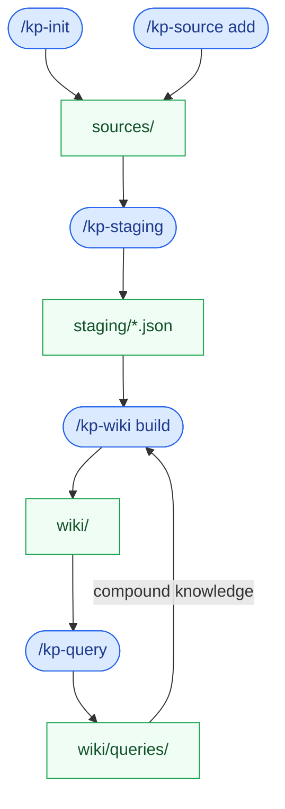

# Knowledge Project Skills

A collection of reusable AI agent skills for **knowledge projects** - projects that
start with existing documentation and treat it as raw material. The goal is to
**progressively extract, organize, and surface** the knowledge inside so agents and
humans can use it without reading everything.

The pipeline ingests sources, extracts entities, concepts, names, and facts using an
LLM, then builds a navigable wiki you can query. The primary target is not code
generation - it is structured knowledge: entities, facts, relationships, timelines,
summaries, and a navigable wiki built from what was already written.

Some formats need preprocessing scripts to surface text and metadata a plain read
would miss (page boundaries, table structure, cell types). For those, skills ship
Python scripts in their `scripts/` directory. Plain-text formats are read directly.

Skills target Claude Code, Cursor, Codex, and compatible assistants.

[AI Research OS](https://github.com/iusztinpaul/ai-research-os-workshop) uses very
similar concepts, so names are intentionally chosen to be compatible with that
project's vocabulary. It predates this project, and several conventions here
(the skills scripts structure, for example) are borrowed from it.

Examples of knowledge projects:
- A product team with scattered specs and ADRs who wants a queryable knowledge base
- Competitive intelligence from earnings calls, filings, and analyst reports
- Research synthesis across hundreds of papers
- Domain glossary construction from technical documentation

---

## Agentic documentation enables progressive disclosure

The goal is **agentic documentation**: a file-based semantic layer structured
for agent consumption so that agents can navigate knowledge progressively —
starting from a small, stable entry point and going deeper on demand, without
loading the full corpus into context.

Traditional documentation is written for humans reading linearly. Agents work
differently: they query non-linearly, compose answers from fragments across
many sources, and need unambiguous terminology to avoid hallucination. Prose
that works for humans is verbose, context-dependent, and unsearchable at the
entity level.

The pipeline builds a four-tier semantic layer from your existing documentation:

| Tier | Files | What it gives agents |
|---|---|---|
| **Entity index** | `staging/<id>.json` | Named entities with type, source, and context - per source |
| **Resolved glossary** | `wiki/glossary.md` | Canonical terms, aliases, definitions, cross-references - across all sources |
| **Navigable wiki** | `wiki/*.md` with `[[wikilinks]]` | Relationship graph between concepts, readable in Obsidian or VS Code |
| **Agent index** | `wiki/index.yaml` | Typed, structured entry point - no Markdown parsing required |

This structure makes progressive disclosure possible:

- `/kp-init` gives you the scaffold immediately.
- `/kp-source` adds one source at a time.
- `/kp-staging` produces useful output per source - no need to wait for the full corpus.
- `/kp-wiki build` improves incrementally with each new extraction - glossary and pages regenerate together.
- `/kp-query` works at any stage; each question is saved and feeds the next build.

An agent always starts from `wiki/index.yaml` - a typed, stable map - and follows
links only as deep as the question requires. The semantic layer is what makes
that navigation precise instead of speculative.

### AX (Agent Experience) properties

- **Stable, typed entry point** - `wiki/index.yaml` requires no Markdown parsing; agents read structure, not prose.
- **Alias resolution** - the glossary normalizes synonyms so agents do not treat "ML model", "model", and "trained model" as three different things.
- **Source attribution** - every fact carries `source_ref`, so agents cite and verify rather than assert.
- **Gap visibility** - each question records confidence and answer sources, giving `/kp-wiki build` a signal for where the layer is thin.

---

## Project layout (created by `init`)

```
project-root/
├── sources/              # Raw inputs: PDFs, URLs, database dumps, CSVs, etc.
│   └── <source-id>/      # One subdirectory per source
├── staging/              # Structured output, one JSON per source
│   └── <source-id>.json  # Entities, summary, dates, key facts, schema, etc.
├── wiki/                   # Knowledge base - generated and maintained by skills
│   ├── index.yaml        # Agent entry point: typed links, KB metadata, search hints
│   ├── index.md          # Human / Obsidian entry point: navigable starting page
│   ├── glossary.md       # Resolved terminology, aliases, cross-references
│   ├── queries/          # Compound query knowledge (feeds back into /kp-wiki build)
│   │   └── YYYY-MM-DD-<slug>.md  # One file per question: answer + how it was generated
│   └── <topic>.md        # One page per entity or concept (wikilinks throughout)
└── .knowledge-project    # Project config and schema version
```

---

## Workflow



Skills are shown in blue, file artifacts in green. The feedback loop from `/kp-query` back into `/kp-wiki build` is what makes the KB improve incrementally over time.

---

## Skills / Commands

### `kp-init`
Scaffold a new knowledge project in the current directory.

Creates the directory structure above, writes `.knowledge-project` with project metadata, and generates stub files so the pipeline has a known shape from the start.

```
/kp-init
```

---

### `kp-source`
Manage sources: add new ones, check for updates, track provenance.

Operations:
- Add a PDF, URL, database connection, or CSV as a new source
- Check whether a previously seen source has changed
- Record ingestion metadata (ingested-at, hash, origin URL, page count, etc.)
- List all sources and their ingestion status

```
/kp-source add <path-or-url>
/kp-source status
/kp-source check-updates
```

---

### `kp-staging`
Run LLM-based or rule-based extractors over ingested sources and write structured output to `staging/`.

Each extraction produces a JSON file containing:
- `entities` - people, organizations, places, products, concepts
- `summary` - short and long-form summaries
- `key_facts` - discrete, citable claims
- `dates` - timeline events with ISO dates
- `schema` (for structured sources) - table names, column types, relationships
- `images` (for PDFs) - extracted figures with captions
- `source_ref` - back-pointer to the originating source

```
/kp-staging <source-id>
/kp-staging --all
/kp-staging --model claude-opus-4-8
```

---

### `kp-query`
Ask a question against the knowledge base. The question, answer, and a record of
how the answer was generated (which KB pages, extractions, or raw sources were
used, and with what confidence) are saved to `wiki/queries/` as a dated Markdown file.

Each question file becomes part of the KB itself. On the next `/kp-wiki build` run,
the questions directory is read as an additional input: frequently asked topics
become first-class KB pages, low-confidence answers flag gaps for the next
`/kp-staging` pass, and the answer-source trail informs how entities are linked.
This is **compound knowledge** - the KB gets better at answering related questions
over time without re-reading every source.

```
/kp-query "What are the main claims about X?"
/kp-query --gaps              # List low-confidence questions from wiki/queries/
/kp-query --related "X"       # Show past questions related to a topic
```

---

### 'wiki'
Build or update the knowledge base under `wiki/` from extracted content.

Internally runs the full synthesis pipeline: resolves entity aliases, generates `wiki/glossary.md`, writes one Markdown page per entity, and produces both entry points (`wiki/index.md` for Obsidian, `wiki/index.yaml` for agents). Also reads `wiki/queries/` - frequently asked topics become first-class pages, low-confidence answers trigger extraction gap warnings.

```
/kp-wiki build
/kp-wiki update
/kp-wiki add-page <topic>
```

---

## Compatibility

Concept names align with [ai-research-os-workshop](https://github.com/iusztinpaul/ai-research-os-workshop):

| This project | ai-research-os-workshop |
|---|---|
| `sources/` | raw data / documents layer |
| `staging/` | processed / structured layer |
| `wiki/glossary.md` | ontology / vocabulary |
| `wiki/` | knowledge base |
| `wiki/queries/` | retrieval + feedback loop |

---

## Installation

Skills follow the [Agent Skills](https://agentskills.io) open standard - each
skill is a folder with a `SKILL.md` file, compatible with Claude Code, Cursor,
Codex, Gemini CLI, and others.

### Via skills.sh (recommended)

Install directly using the [skills.sh](https://skills.sh) CLI:

```bash
npx skills add https://github.com/rangzen/knowledge-project-skills
```

To update later:

```bash
npx skills update
```

### Manual install

Clone the repo and copy the skill folders into your agent's skills directory:

```bash
git clone https://github.com/<org>/knowledge-project-skills

# Claude Code (global):
cp -r knowledge-project-skills/skills/* ~/.claude/skills/

# Claude Code (project-local):
cp -r knowledge-project-skills/skills/* .claude/skills/

# Cross-agent (.agents/skills/ convention):
cp -r knowledge-project-skills/skills/* .agents/skills/

# Other agents: see docs/references/agentskills-io.md for per-agent paths
```

Skills that include a `scripts/` directory require Python 3.11+. Dependencies
are listed in each skill's `scripts/requirements.txt`.

---

## Repository validation

Validate that every Markdown link in a skill resolves within that skill's
installable directory:

```bash
python3 scripts/validate_skill_links.py
```

---

## Status

Early development. Contributions and issue reports welcome.
